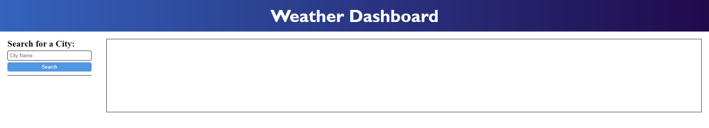
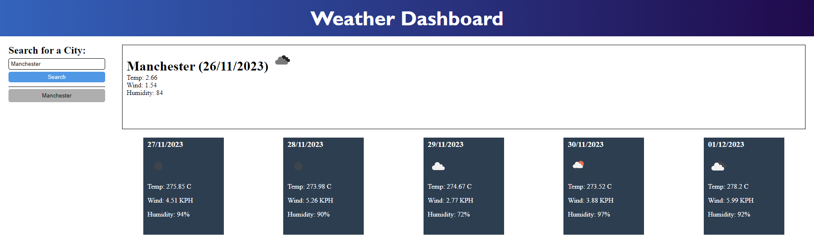
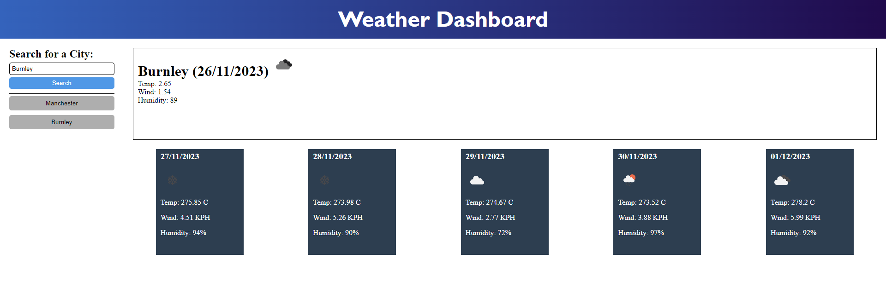
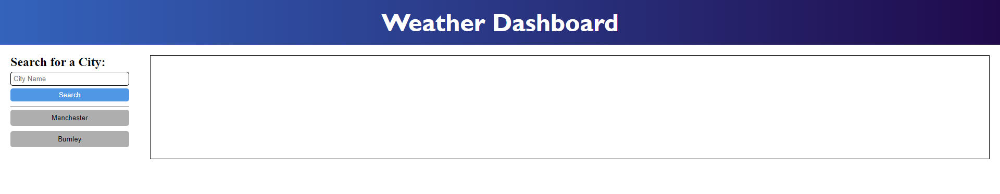

# Weather Dashboard

## Table of Contents
* [Screenshot of page](#screenshot)
* [Information](#information)
* [Installation](#installation)
* [License](#license)
* [Tests](#tests)

## Screenshot

## Information
The top of this page contains a header

The header contains text

Underneath this header, there is an input box, a button and a text box

When the user enters a valid city name into the input box and presses the search button, the city name, current date and a symbol displaying the weather appear in the display box. A button containing the city name also appears. These buttons can be clicked on to display the information for that city.

Underneath this, information about the current weather in that location appears.

Underneath the display box, five other display boxes appear with information of the predicted weather over the next 5 days. Each display box, the date on that day, a symbol displaying the predicted weather for that day and information about the predicted weather for that day are shown.

When the user refreshes the page, the text box containing the current weather and the text boxes displaying the predicted weather for the next 5 days are removed. However, the city names underneath the input box are still displayed and can be clicked on.

## Installation
Click on this link: https://programmer90000.github.io/weather-dashboard/

## License
GNU GENERAL PUBLIC LICENSE (GPL) version 3.0

## Tests
Enter a city name into the text box. Check if the display box updates

Enter a different city name into the text box. Check if the display box updates

Enter incorrect city names into the text boxes. Check if an error message is displayed

Reload the page after entering a valid city name. Check if the city button remains

Click on one of the city buttons. Check if the display box updates